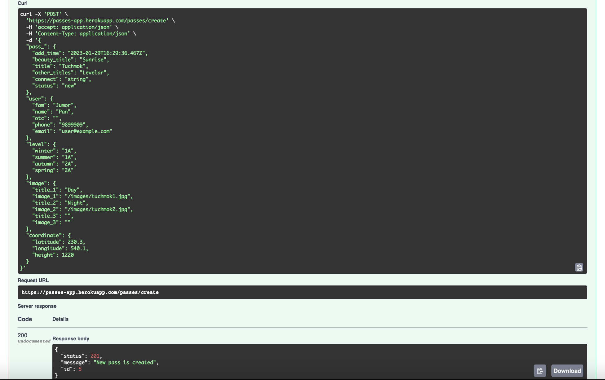
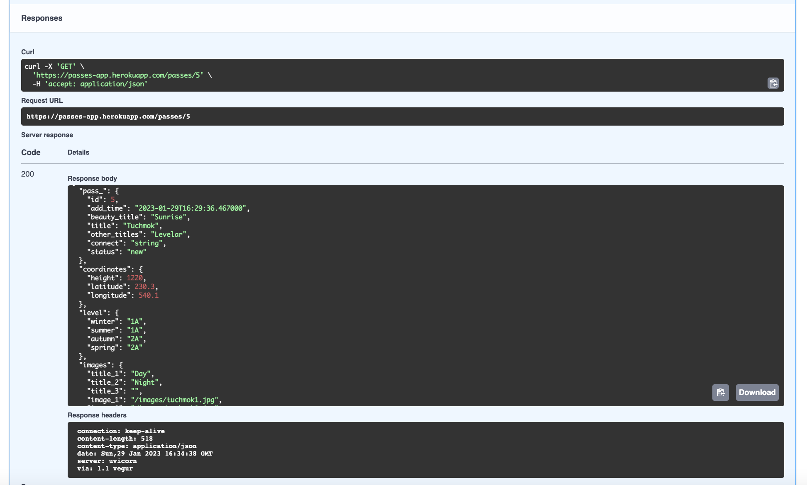
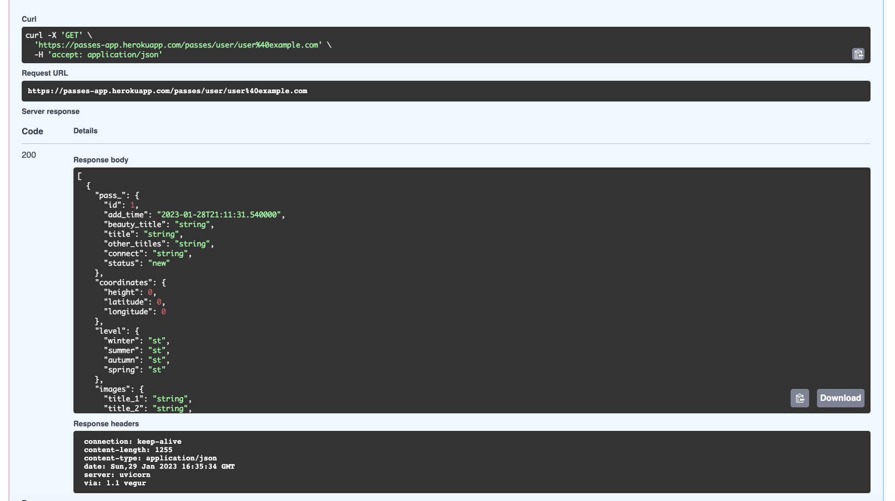
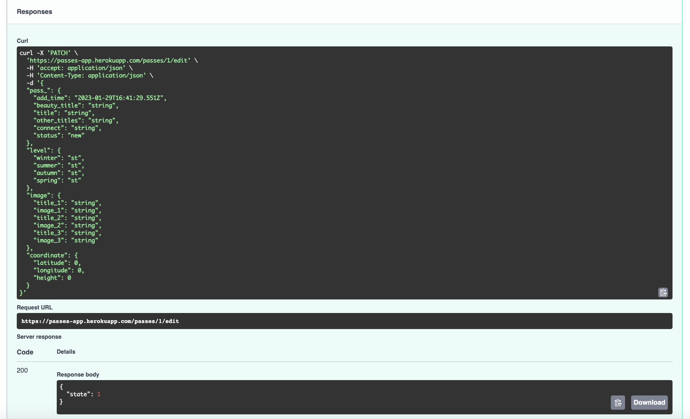
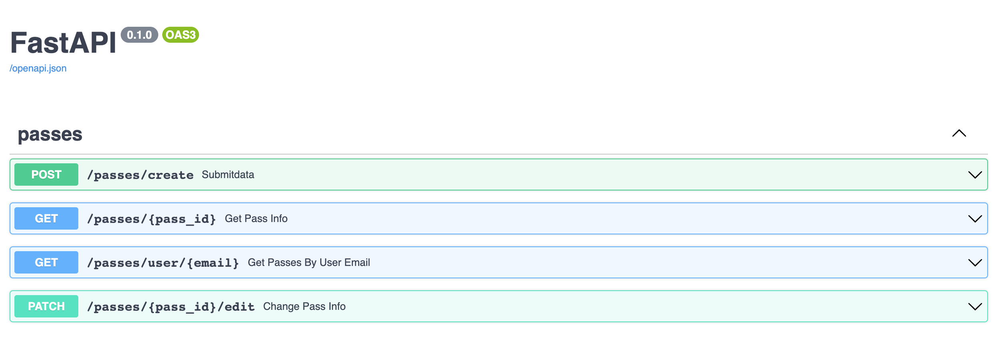

# Passes-app
Simple REST API project. It is a part of a mobile app for hikers. It can be used to add an information about a new pass to the big database for hike lovers. 

Live demo: https://passes-app.herokuapp.com/docs
<!-- If you have the project hosted somewhere, include the link here. -->

## Table of Contents
* [General Info](#general-information)
* [Technologies Used](#technologies-used)
* [Features](#features)
* [Screenshots](#screenshots)
* [Setup](#setup)
* [Usage](#usage)
* [Project Status](#project-status)
* [Room for Improvement](#room-for-improvement)
* [Acknowledgements](#acknowledgements)
* [Contact](#contact)
<!-- * [License](#license) -->

## General Information
What can this app do? It adds an information about a new pass to the database. All the information is provided by any hiker that would like to share. 
Name of the pass, its coordinates, images and level of difficulty - everything counts. It is also possible to change an information about passes in the database or get all the information regarding the selected pass by its id. You can also check which passes were added by concrete user (providing his or her email).

This project is a part of my Python and REST API studies.  
<!-- You don't have to answer all the questions - just the ones relevant to your project. -->

## Technologies Used
- fastapi=0.89.1
- uvicorn=0.20.0
- sqlalchemy=1.4.46
- pydantic[email]=1.10.4
- python-dotenv=0.21.0
- psycopg2-binary=2.9.5
- gunicorn=20.1.0

- Python=3.11

## Features
List of features:
- Add a new pass to the database (post)
- Get an info about the pass by its id (get)
- Get an info about all the passes which were added by concrete user using his or her email (get)
- Change an info regarding selected pass (patch)

## Screenshots

<!-- If you have screenshots you'd like to share, include them here. -->

## Setup
1. Use requirements.txt file to install dependencies.
2. Please provide an information about your database here: database/database.py --> SQLALCHEMY_DATABASE_URL = "" .
3. Use .env file for all important configs. 
4. Start API in your local environment by entering the command "uvicorn main:app --reload". 
5. Open "127.0.0.1/docs" page to enter Swagger.

## Usage
- Use 'Submitdata' request to add a new pass to the database.
- Use 'Get Pass Info' request to get an info about the pass by its id.
- Use 'Get Passes By User Email' request to get an info about passes which were added by concrete user (using his or her email).
- Use 'Change Pass Info' request to change an information about the pass by its id.

## Project Status
Project is: _no longer being worked on_.

## Room for Improvement
There are too many :)

## Acknowledgements
Many thanks to the community.

## Contact
Created by [@NoireMare] - feel free to contact me!

<!-- Optional -->
<!-- ## License -->
<!-- This project is open source and available under the [... License](). -->

<!-- You don't have to include all sections - just the one's relevant to your project -->
